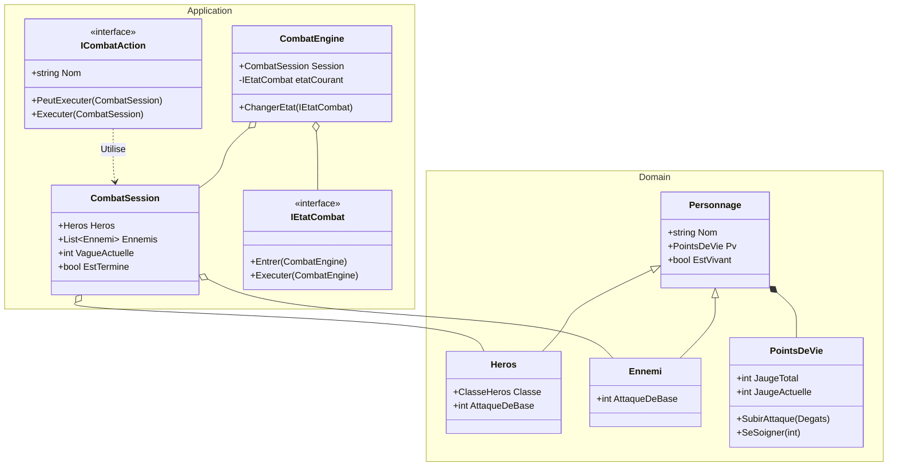

# Jeu de Combat au Tour par Tour

Ce projet est un jeu de combat tactique en console développé en C#. Il sert de support pour valider la mise en pratique de la **Clean Architecture** et l'implémentation de plusieurs **Design Patterns** fondamentaux.

---

## Architecture du Projet

Le code est structuré en trois projets distincts afin de garantir un découplage total entre la logique métier et l'affichage :

* **`CombatTourParTour.Domain`** : Le cœur de l'application (Entités, Value Objects, Enums). Il ne possède aucune dépendance externe.
* **`CombatTourParTour.Application`** : Logique de l'application (Moteur de combat, orchestration des états et des stratégies).
* **`CombatTourParTour.Cli`** : Interface utilisateur (Console), point d'entrée de l'exécutable.

---

## Configuration et Exécution

### Prérequis
* SDK .NET 8.0 (ou supérieur)

### Lancer l'application
Exécutez la commande suivante à la racine du dossier principal (`TpCombatCli`) :

```bash
dotnet run --project src/CombatTourParTour.Cli
```

---

## Règles du Jeu

Le jeu simule un affrontement par vagues successives :

1. **Initialisation** : Le joueur saisit son nom et commence la partie avec un **Guerrier** (120 PV, 18 d'Attaque de base).
2. **Phase du Joueur** : À chaque tour, le joueur choisit une action :
   * `[1] Attaquer` : Inflige des dégâts (calculés via le domaine) au premier ennemi vivant.
   * `[2] Se soigner` : Restaure 25 PV. **Attention : action limitée à 2 utilisations max par partie.**
3. **Phase des Ennemis** : Chaque monstre encore en vie attaque le héros à son tour.
4. **Fin de partie** :
   * **Victoire** si tous les ennemis de la vague tombent à 0 PV.
   * **Défaite (Game Over)** si les PV du héros atteignent 0.

---

## Justification des Design Patterns

* **Factory (`HerosFactory`, `EnnemiFactory`)**
  Centralise la configuration et l'initialisation des statistiques des personnages. Cela évite d'éparpiller les valeurs brutes (PV, dégâts) dans le reste du code.

* **Strategy (`ICombatAction`, `AttaqueBasiqueAction`, `SoinAction`, `IAiStrategy`, `AttaqueAleatoireAi`)**
  Encapsule les compétences et les comportements de l'IA dans des classes isolées. Permet d'ajouter de nouvelles actions (comme un sort) sans modifier la boucle principale du jeu (Principe Open/Closed).

* **State (`CombatEngine`, `IEtatCombat`, `TourJoueurState`, `TourEnnemiState`...)**
  Gère le cycle et l'enchaînement des phases de combat. Supprime le besoin de structures conditionnelles complexes (`if/else` ou `switch` imbriqués) dans la boucle globale.

* **Observer (`ICombatObserver`, `CombatEventPublisher`, `JournalCombatObserver`)**
  Permet au moteur de jeu de notifier les actions (dégâts, mort d'une entité) sans être couplé à la console. L'affichage des logs est ainsi totalement indépendant de la logique métier.

---

## Diagramme de Classes

